# 沙漠场景制作

文档，制作思路，参数设置 ...

### 效果：

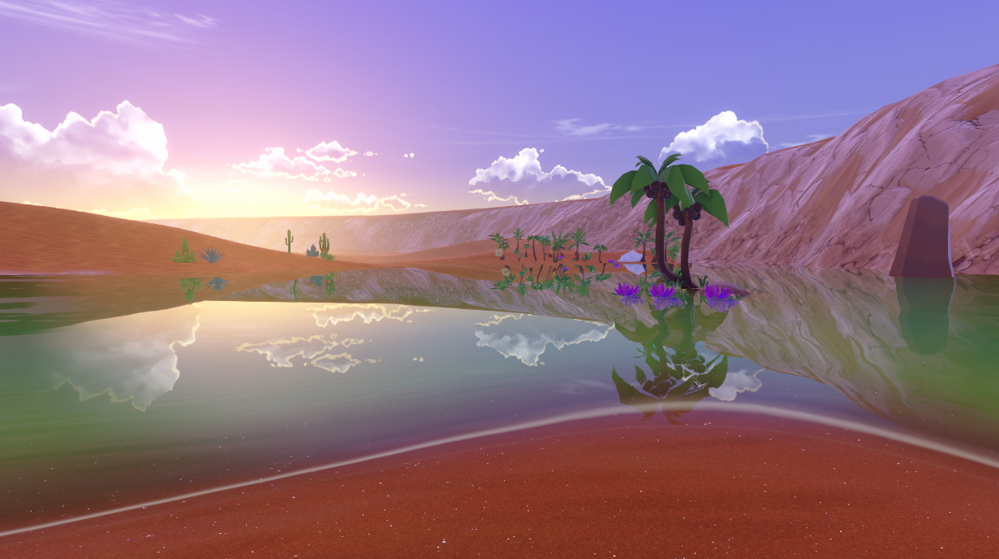

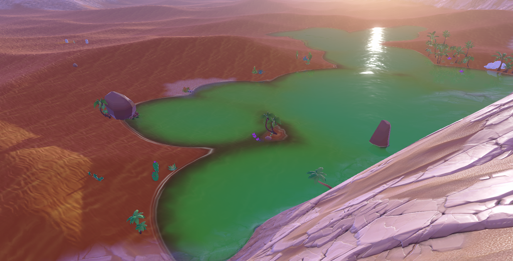

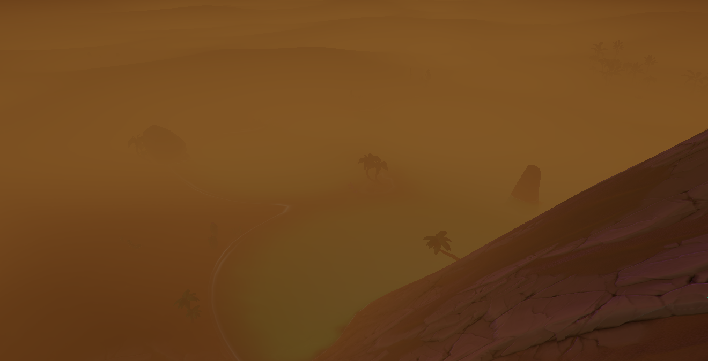

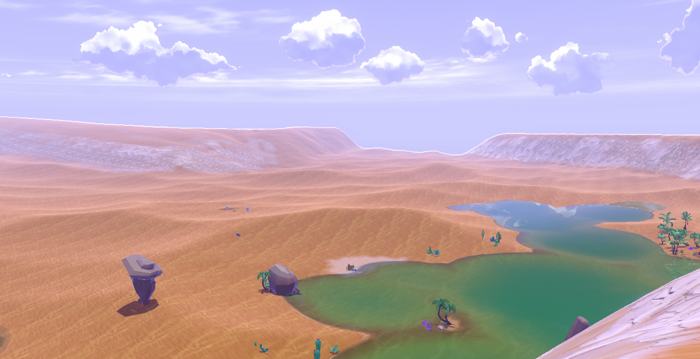

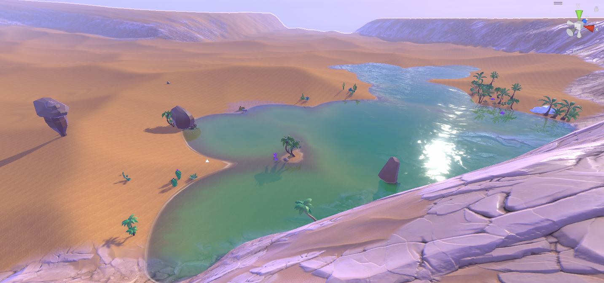

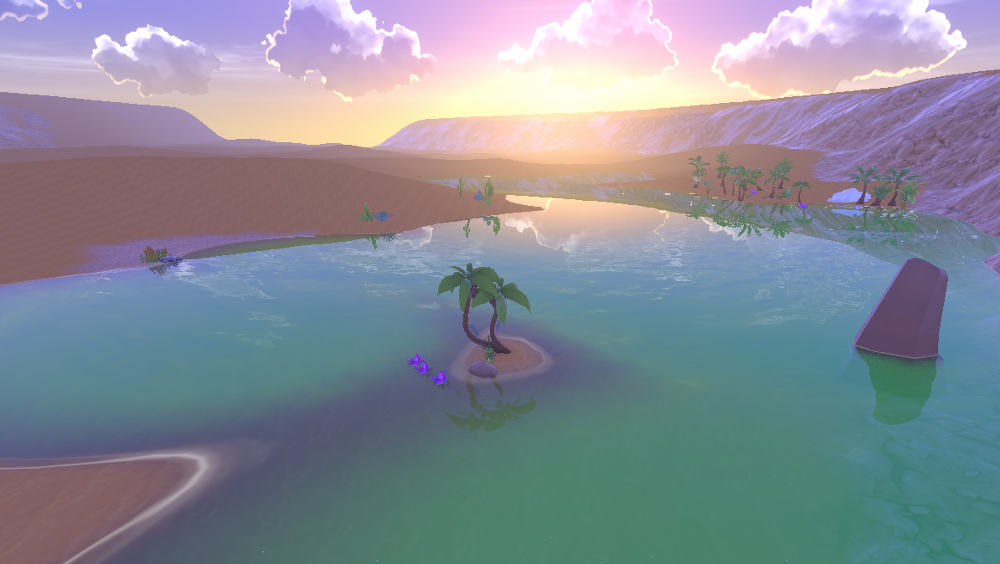

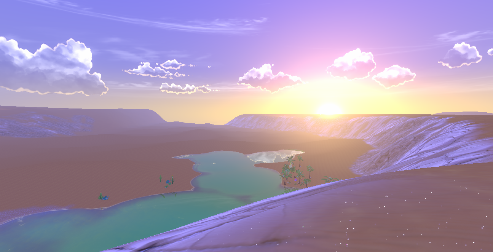

### 使用工具：

- **Unity：2021.3.18f1c1** 版本，URP 渲染管线，延迟渲染；
- **Substance designer** 
- **Houdini：19.0.589**

### 资源来源：

- Assets Store：Stylized Ground Textures (部分贴图)，Desert Pack （植物）,
                            Magica Bone 2 (角色物理与动画)；
- 使用 DCC 软件制作：包括地形，地形贴图等；
- mihoyo：角色模型，角色贴图，云朵贴图。

> com.unity.render-pipelines.universal 和 com.unity.render-pipelines.core 均有修改

### 思路：

提起沙漠，首先想到的就是广袤无垠的沙丘，裸露的风化侵蚀的岩石，难以寻觅的动植物，和难得一见的绿洲的点缀，有晴天时万里无云的，也有风暴来临时风沙骤起。走在沙漠上时，细沙被排开，脚会陷进沙中。于是就决定先实现以上一些效果，虽然缺少经验，但也不失为一次挑战。

### 资源准备：

首先是地形，这里我使用 Houdini 制作了一个：

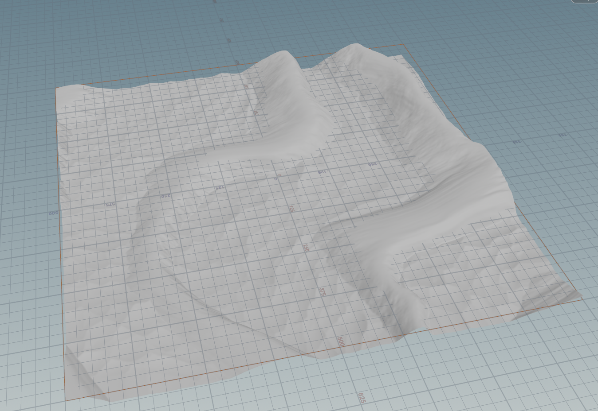

然后是准备沙地的贴图，除了表现 BRDF 材质的贴图，为了实现沙砾闪烁和流沙的效果，还需要制作 flowmap 贴图，噪声图，这里  flowmap 用 houdini 制作，其他自造贴图使用 substance designer。

### 主要实现效果：

- **沙砾闪烁**
  主要想法是使用制作的圆点噪声图，分别在物体表面和屏幕空间充当遮罩mask，从而得到像素点是否是应该闪烁的沙砾。将结果加上 diffuse Color，存入 Gbuffer 的 diffuse 通道中。
  **实现文件：**DesertTerrainShader.shader 等

- **流沙效果**
  使用 flowmap，通过贴图上的向量决定沙子的流动。结果加上 diffuse 存入 Gbuffer，其结果还可以用于控制前面沙砾的闪烁。
  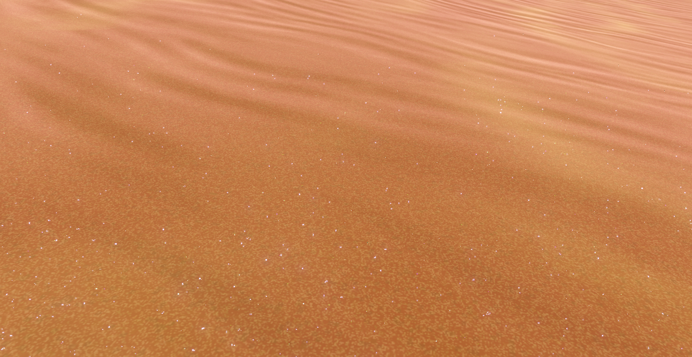

  **实现文件：**DesertTerrainShader.shader 等

  **参数设置：**
  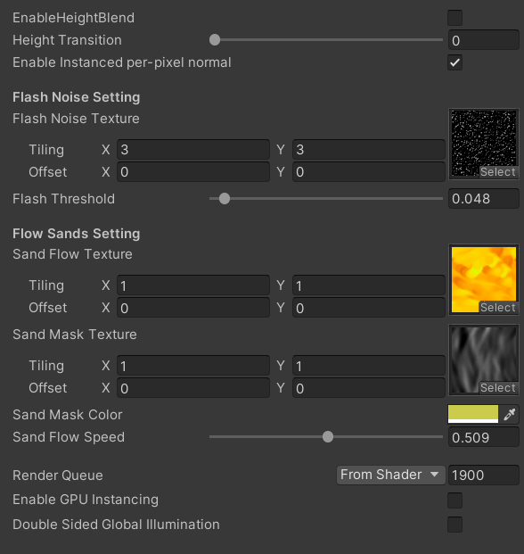

  

- **水体渲染**
  要实现沙漠绿洲，其中的水是不可或缺的。水的渲染思路是用菲涅尔项控制折射和反射，折射采用采样 _CameraOpaqueTexture 获得，为了更好 的效果可加入采样扰动变形，再加入次表面散射的颜色。反射就是关键了，之前写过两倍pass的平面渲染，但由于使用延迟渲染，加大场景顶点数量总多，故选择屏幕空间方法，这里我选择 SSPR，相对节省性能。

  
  这里实现了两种 SSPR 方案，一种不使用同步语句 InterlockedMin，但是有瑕疵，另一种使用，但是可能会有设备的适配问题。
  最后就是添加浪花，焦散等效果，平面水面的渲染主要就是这些。

  
  
  **实现文件：**PlanarWaterShade.shader  SSPRMapping.compute  等
  
  **参数设置：**
  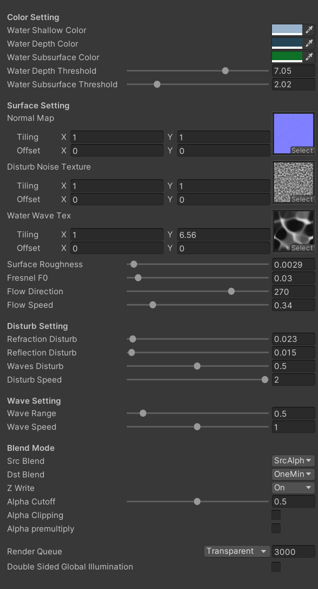
  
  
  
- **天空盒**
  主要困难时保证风格化的同时又能有一些出色的效果，于是进行拆分：
  **首先**基础的天空日夜和过渡颜色直接用颜色过渡，方便做出美术化的调整；
  **然后**依然使用简化的大气散射模型，获得一些散射效果，主要是 Mie 散射，因为其首视角和光线夹角影响大，可以看作其光路近乎在直线上，于是便可省去积分。（Rayleigh散射效果我已经用上面的 base color 替代）由于现实的 mie 散射不受光波长影响，无色彩变幻，这里为了可调的效果还是用 rgb 三个分量控制散射系数。
  **接下来**是画出太阳，月亮，云朵等，这里不多说。
  **实现文件：**ProceduralSkyboxShader.shader  等
  **参数设置：**
  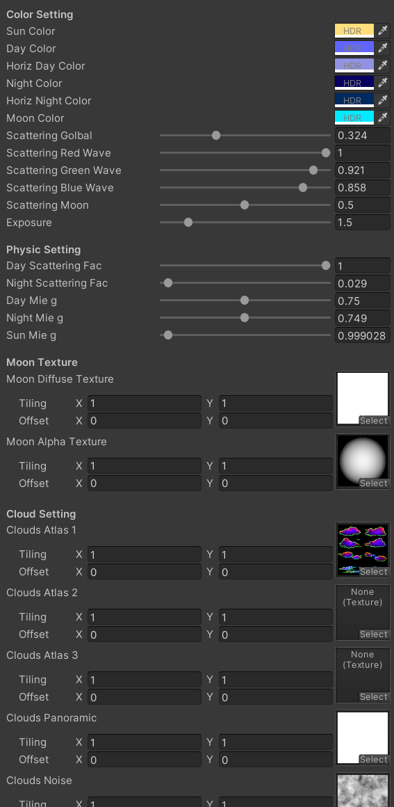
  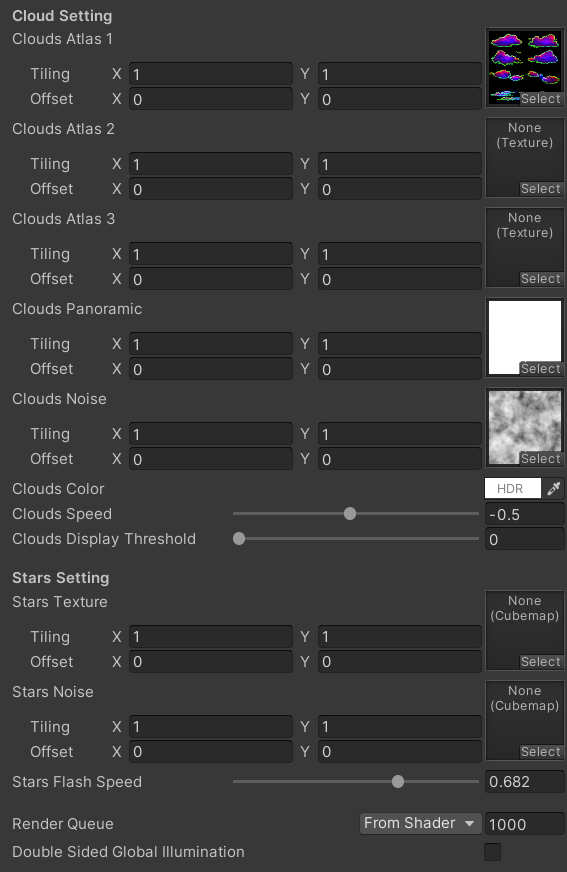

- **屏幕空间雾气**
  雾气透射与天空盒搭配，才能有比较好的效果。延迟渲染自然使用后处理雾气。这里可以添加 RendererFeature，但为了减少不必要的 Blit 次数，这次直接修改 URP 源码，写进 PostProcessPass.cs 中。实现了大气衰减，线性高度雾，线性距离雾，mie 大气散射，和动态扰动高度雾，用以实现风沙效果。
  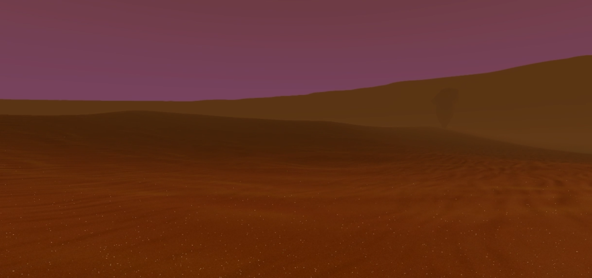
  
  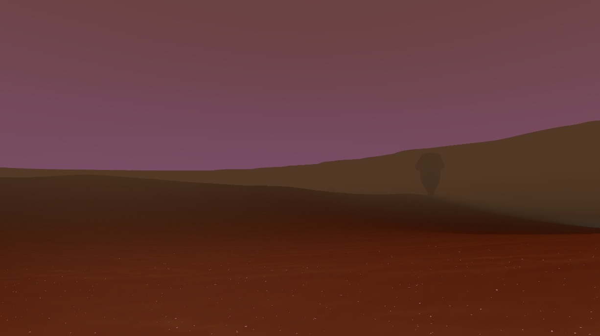
  
  **实现文件：**(Package URP) PostProcessPass.cs ScreenSpaceFog.shader 等
  **参数设置：**(Volume)
  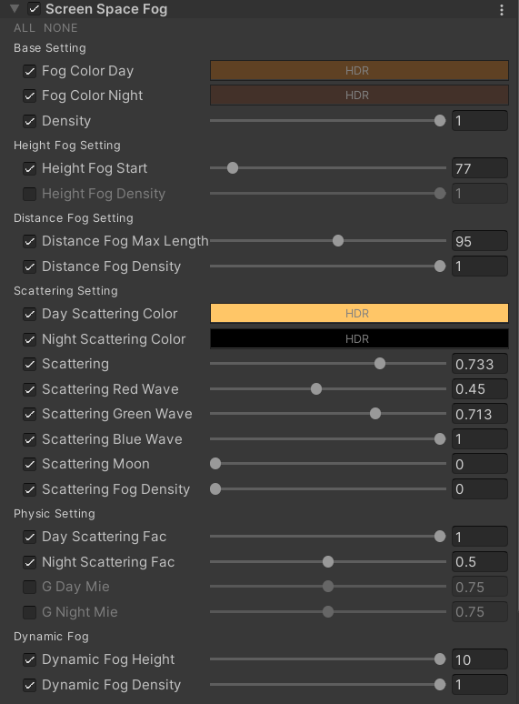
  
- **屏幕空间边缘光**
  主要是利用法线偏移采样深度图，确定边缘。
  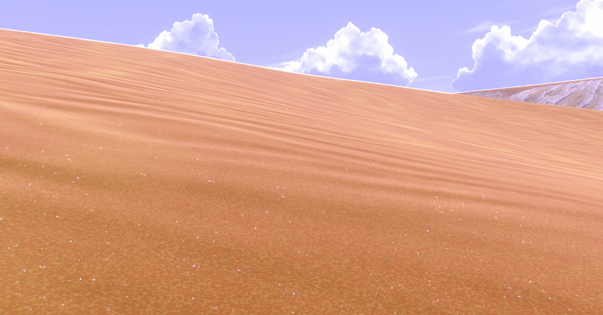
  
- **实现可交互的沙地，产生凹陷**
  效果的实现主要是解决两个问题，一是得知是否产生凹陷，二是如何制作凹陷。
  对于第一个问题，我们可以在渲染 GBuffer 前获取该信息。可以使用一个在地底的从下至上的正交相机的参数做相机覆盖，先渲染一遍地面获取地面深度图（Cull front，ZTest GEqual），然后第二遍 pass 渲染应该产生凹陷的物体，比较深度确定是否相交地面，下陷多深；第三遍 pass 结合之前帧形成的路径贴图，继续计入，适当衰减。
  对于第二个问提，如果支持曲面细分，可以使用曲面细分着色器细分，并根据路径图确定新的顶点中高度的偏移，然后重建法线。
  思路大体就是这样。
  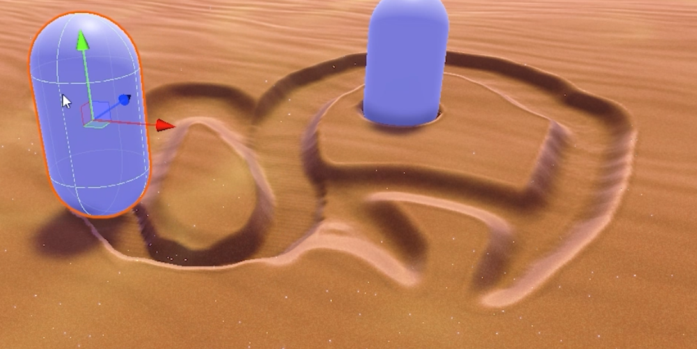
  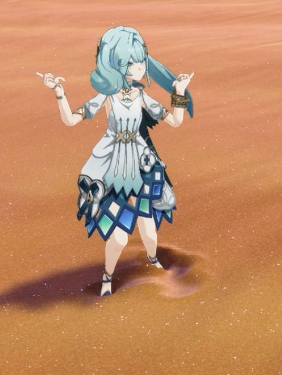
  **实现文件：**PathRecordRendererFeature.cs,  PathRecordBlit.shader, DesertTerrainTesselationLitPass.hlsl 等
  **参数设置：**(Renderer Feature)
  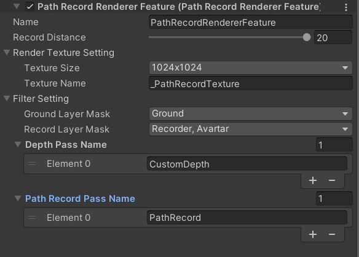

- **自定义 ToneMapping (Gran Turismo)**
  **实现文件：**(Package URP) 
  PostProcessPass.cs, GranTurismoToneMappingShader.shader 等
  **参数设置：**(Volume)
  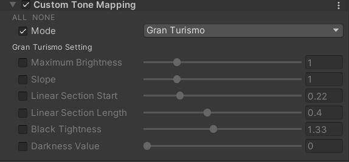

